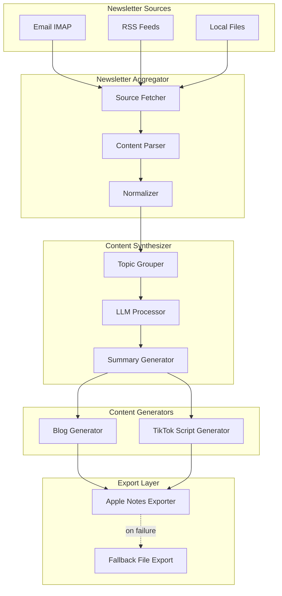
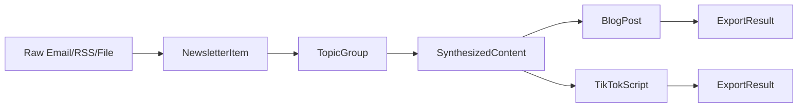

# Design Document: Newsletter Content Generator

## Overview

The Newsletter Content Generator is a macOS command-line application that aggregates tech newsletters from multiple sources, synthesizes the content using an LLM, and generates blog posts and TikTok scripts that are saved to Apple Notes.

The system follows a pipeline architecture with distinct stages: source retrieval → content parsing → AI synthesis → content generation → Apple Notes export.

### Key Design Decisions

1. **Python as implementation language**: Chosen for excellent library support (email parsing, RSS, HTTP), native macOS integration via `macnotesapp`, and strong LLM SDK availability.

2. **Pipeline architecture**: Each stage is independent and testable, allowing for easy extension of sources and output formats.

3. **Configuration-driven**: YAML configuration file controls all behavior, making the system flexible without code changes.

4. **macnotesapp for Apple Notes**: Uses the `macnotesapp` Python library which wraps AppleScript automation, providing a clean Python API for Notes.app interaction.

## Architecture



## Components and Interfaces

### 1. Configuration Manager

Responsible for loading and validating application configuration.

```python
@dataclass
class EmailSourceConfig:
    host: str
    port: int
    username: str
    password: str  # Or reference to env var
    folder: str
    use_ssl: bool = True

@dataclass
class RSSSourceConfig:
    url: str
    name: str

@dataclass
class FileSourceConfig:
    path: str
    pattern: str  # Glob pattern for files

@dataclass
class LLMConfig:
    provider: str  # "openai", "anthropic", etc.
    model: str
    api_key_env: str  # Environment variable name
    max_tokens: int = 4096

@dataclass
class BlogConfig:
    format: str  # "long-form", "summary", "listicle"
    target_words: int
    include_sources: bool = True

@dataclass
class TikTokConfig:
    duration: int  # 15, 30, or 60 seconds
    include_visual_cues: bool = True
    style: str  # "educational", "entertaining", "news"

@dataclass
class NotesConfig:
    account: str  # Apple Notes account name
    blog_folder: str
    tiktok_folder: str

@dataclass
class AppConfig:
    email_sources: list[EmailSourceConfig]
    rss_sources: list[RSSSourceConfig]
    file_sources: list[FileSourceConfig]
    llm: LLMConfig
    blog: BlogConfig
    tiktok: TikTokConfig
    notes: NotesConfig
    date_range_days: int = 7

class ConfigManager:
    def load(self, path: str) -> AppConfig:
        """Load and validate configuration from YAML file."""
        
    def validate(self, config: AppConfig) -> list[str]:
        """Return list of validation errors, empty if valid."""
```

### 2. Newsletter Aggregator

Fetches and parses newsletters from configured sources.

```python
@dataclass
class NewsletterItem:
    source_name: str
    source_type: str  # "email", "rss", "file"
    title: str
    content: str  # Plain text content
    html_content: str | None  # Original HTML if available
    published_date: datetime
    author: str | None
    url: str | None

class SourceFetcher(Protocol):
    def fetch(self, since: datetime) -> list[NewsletterItem]:
        """Fetch newsletter items since the given date."""

class EmailFetcher:
    def __init__(self, config: EmailSourceConfig):
        self.config = config
    
    def fetch(self, since: datetime) -> list[NewsletterItem]:
        """Connect via IMAP, fetch emails from folder, parse content."""

class RSSFetcher:
    def __init__(self, config: RSSSourceConfig):
        self.config = config
    
    def fetch(self, since: datetime) -> list[NewsletterItem]:
        """Fetch and parse RSS feed entries."""

class FileFetcher:
    def __init__(self, config: FileSourceConfig):
        self.config = config
    
    def fetch(self, since: datetime) -> list[NewsletterItem]:
        """Read local files matching pattern."""

class ContentParser:
    def extract_text(self, html: str) -> str:
        """Extract main content from HTML, removing ads/headers/footers."""
    
    def clean_content(self, text: str) -> str:
        """Normalize whitespace, remove boilerplate."""

class NewsletterAggregator:
    def __init__(self, fetchers: list[SourceFetcher], parser: ContentParser):
        self.fetchers = fetchers
        self.parser = parser
    
    def aggregate(self, since: datetime) -> list[NewsletterItem]:
        """Fetch from all sources, parse, and return normalized items."""
```

### 3. Content Synthesizer

Uses LLM to analyze, group, and summarize newsletter content.

```python
@dataclass
class TopicGroup:
    topic: str
    description: str
    items: list[NewsletterItem]
    key_points: list[str]

@dataclass
class SynthesizedContent:
    topics: list[TopicGroup]
    overall_summary: str
    trending_themes: list[str]
    source_count: int
    date_range: tuple[datetime, datetime]

class LLMClient(Protocol):
    def complete(self, prompt: str, system: str | None = None) -> str:
        """Send prompt to LLM and return response."""

class OpenAIClient:
    def __init__(self, api_key: str, model: str):
        self.client = openai.OpenAI(api_key=api_key)
        self.model = model
    
    def complete(self, prompt: str, system: str | None = None) -> str:
        """Call OpenAI API."""

class ContentSynthesizer:
    def __init__(self, llm: LLMClient):
        self.llm = llm
    
    def group_by_topic(self, items: list[NewsletterItem]) -> list[TopicGroup]:
        """Use LLM to identify topics and group related items."""
    
    def extract_key_points(self, group: TopicGroup) -> list[str]:
        """Extract key points from a topic group."""
    
    def generate_summary(self, topics: list[TopicGroup]) -> str:
        """Generate overall summary of all content."""
    
    def synthesize(self, items: list[NewsletterItem]) -> SynthesizedContent:
        """Full synthesis pipeline: group, extract, summarize."""
```

### 4. Content Generators

Generate blog posts and TikTok scripts from synthesized content.

```python
@dataclass
class BlogPost:
    title: str
    content: str  # Markdown formatted
    word_count: int
    sources: list[str]
    generated_at: datetime

@dataclass
class TikTokScript:
    title: str
    hook: str
    main_points: list[str]
    call_to_action: str
    visual_cues: list[str] | None
    duration_seconds: int
    full_script: str
    generated_at: datetime

class BlogGenerator:
    def __init__(self, llm: LLMClient, config: BlogConfig):
        self.llm = llm
        self.config = config
    
    def generate(self, content: SynthesizedContent) -> BlogPost:
        """Generate a blog post from synthesized content."""
    
    def _build_prompt(self, content: SynthesizedContent) -> str:
        """Build LLM prompt based on configured format."""

class TikTokScriptGenerator:
    def __init__(self, llm: LLMClient, config: TikTokConfig):
        self.llm = llm
        self.config = config
    
    def generate(self, content: SynthesizedContent) -> TikTokScript:
        """Generate a TikTok script from synthesized content."""
    
    def _build_prompt(self, content: SynthesizedContent) -> str:
        """Build LLM prompt for script generation."""
```

### 5. Apple Notes Exporter

Saves generated content to Apple Notes using macnotesapp.

```python
@dataclass
class ExportResult:
    success: bool
    note_id: str | None
    folder: str
    error: str | None
    fallback_path: str | None

class NotesExporter:
    def __init__(self, config: NotesConfig):
        self.config = config
        self.notes_app = NotesApp()
    
    def export_blog(self, post: BlogPost) -> ExportResult:
        """Save blog post to Apple Notes."""
    
    def export_tiktok(self, script: TikTokScript) -> ExportResult:
        """Save TikTok script to Apple Notes."""
    
    def _ensure_folder(self, folder_name: str) -> bool:
        """Ensure folder exists in Notes, create if needed."""
    
    def _format_for_notes(self, content: str, metadata: dict) -> str:
        """Format content with metadata for Notes."""
    
    def _fallback_save(self, content: str, filename: str) -> str:
        """Save to local file if Notes unavailable."""
```

### 6. Application Orchestrator

Coordinates the full pipeline execution.

```python
@dataclass
class ExecutionResult:
    success: bool
    newsletters_processed: int
    blog_exported: ExportResult | None
    tiktok_exported: ExportResult | None
    errors: list[str]
    dry_run: bool

class NewsletterContentGenerator:
    def __init__(self, config: AppConfig):
        self.config = config
        self._setup_components()
    
    def _setup_components(self):
        """Initialize all pipeline components."""
    
    def run(self, dry_run: bool = False) -> ExecutionResult:
        """Execute the full pipeline."""
    
    def _report_progress(self, stage: str, message: str):
        """Report progress to user."""
```

## Data Models

### Internal Data Flow



### Configuration File Schema

```yaml
# config.yaml
sources:
  email:
    - host: imap.gmail.com
      port: 993
      username: user@gmail.com
      password_env: GMAIL_APP_PASSWORD
      folder: Newsletters
      use_ssl: true
  
  rss:
    - name: TechCrunch
      url: https://techcrunch.com/feed/
    - name: Hacker News
      url: https://news.ycombinator.com/rss
  
  files:
    - path: ~/newsletters
      pattern: "*.html"

llm:
  provider: openai
  model: gpt-4o
  api_key_env: OPENAI_API_KEY
  max_tokens: 4096

output:
  blog:
    format: long-form  # long-form, summary, listicle
    target_words: 1000
    include_sources: true
  
  tiktok:
    duration: 60  # 15, 30, or 60
    include_visual_cues: true
    style: educational  # educational, entertaining, news

notes:
  account: iCloud
  blog_folder: Generated Blog Posts
  tiktok_folder: TikTok Scripts

settings:
  date_range_days: 7
```


## Correctness Properties

*A property is a characteristic or behavior that should hold true across all valid executions of a system—essentially, a formal statement about what the system should do. Properties serve as the bridge between human-readable specifications and machine-verifiable correctness guarantees.*

### Property 1: Configuration Round-Trip

*For any* valid configuration object, serializing it to YAML and parsing it back should produce an equivalent configuration object.

**Validates: Requirements 8.1**

### Property 2: Configuration Validation Errors

*For any* invalid configuration (missing required fields, invalid values), the ConfigManager should return a non-empty list of descriptive error messages.

**Validates: Requirements 8.4**

### Property 3: Date Range Filtering

*For any* set of NewsletterItems with various dates and any date range, the filtered result should contain only items whose published_date falls within the specified range.

**Validates: Requirements 2.1**

### Property 4: Content Normalization

*For any* raw content from any source type (email, RSS, file), the parser should produce a valid NewsletterItem with all required fields populated (source_name, source_type, title, content, published_date).

**Validates: Requirements 2.4, 1.4**

### Property 5: Source Failure Resilience

*For any* set of configured sources where one or more sources fail, the aggregator should still return items from all successful sources and the total item count should equal the sum of items from non-failing sources.

**Validates: Requirements 1.5, 2.5**

### Property 6: Blog Post Structure

*For any* generated BlogPost, the content should contain a title, and the Markdown content should include identifiable sections (introduction, body, conclusion) and source attributions for all input sources.

**Validates: Requirements 4.2, 4.3**

### Property 7: Blog Word Count Targeting

*For any* target word count configuration, the generated blog post word count should be within 20% of the target (allowing for natural variation in LLM output).

**Validates: Requirements 4.4**

### Property 8: TikTok Script Structure

*For any* generated TikTokScript, it should have a non-empty hook, at least one main point, and a call-to-action.

**Validates: Requirements 5.2, 5.3**

### Property 9: TikTok Duration Targeting

*For any* duration configuration (15, 30, or 60 seconds), the generated script's estimated speaking time (based on word count at ~150 words/minute) should be within 10 seconds of the target duration.

**Validates: Requirements 5.1**

### Property 10: Visual Cues Conditional

*For any* TikTok script generation where include_visual_cues is True, the visual_cues field should be non-empty; when False, it should be None or empty.

**Validates: Requirements 5.5**

### Property 11: Notes Content Formatting

*For any* content exported to Apple Notes, the formatted output should include the original content structure (headers, lists preserved) and metadata (generation date, source list).

**Validates: Requirements 6.3, 6.4**

### Property 12: Fallback on Notes Failure

*For any* export attempt where Apple Notes is unavailable, the exporter should create a local file at the fallback path and the ExportResult should indicate success=False with a non-null fallback_path.

**Validates: Requirements 6.5**

### Property 13: Dry-Run Mode

*For any* execution with dry_run=True, the ExecutionResult should contain generated content (blog_exported and tiktok_exported with content) but no actual notes should be created (verified by note_id being None).

**Validates: Requirements 7.4**

### Property 14: Environment Variable Resolution

*For any* configuration containing environment variable references (e.g., `password_env: MY_VAR`), when that environment variable is set, the resolved configuration should contain the actual value.

**Validates: Requirements 8.5**

## Error Handling

### Source Connection Errors

| Error Type | Handling Strategy |
|------------|-------------------|
| IMAP connection failure | Log error with host/port, continue with other sources |
| IMAP authentication failure | Log error (without credentials), continue with other sources |
| RSS fetch timeout | Log error with URL, continue with other sources |
| RSS parse error | Log error with URL and parse details, continue with other sources |
| File not found | Log warning, continue with other files |
| File read permission denied | Log error with path, continue with other files |

### Content Processing Errors

| Error Type | Handling Strategy |
|------------|-------------------|
| HTML parse failure | Skip item, log warning with source info |
| Empty content after parsing | Skip item, log warning |
| LLM API rate limit | Retry with exponential backoff (3 attempts) |
| LLM API error | Log error, fail gracefully with partial results |
| LLM response parse failure | Log error, retry once, then skip |

### Export Errors

| Error Type | Handling Strategy |
|------------|-------------------|
| Apple Notes unavailable | Save to fallback location, notify user |
| Notes folder creation failure | Use default folder, log warning |
| Note creation failure | Save to fallback, log error |
| Fallback write failure | Log critical error, return failure result |

### Configuration Errors

| Error Type | Handling Strategy |
|------------|-------------------|
| Config file not found | Exit with clear error message and example config |
| Invalid YAML syntax | Exit with parse error location |
| Missing required field | Exit with field name and expected type |
| Invalid field value | Exit with field name, value, and valid options |
| Environment variable not set | Exit with variable name needed |

## Testing Strategy

### Unit Tests

Unit tests verify specific examples and edge cases:

1. **ConfigManager tests**
   - Load valid YAML configuration
   - Load valid JSON configuration
   - Detect missing required fields
   - Detect invalid enum values
   - Resolve environment variables

2. **ContentParser tests**
   - Extract text from simple HTML
   - Remove common newsletter boilerplate
   - Handle malformed HTML gracefully
   - Preserve important formatting

3. **NewsletterItem tests**
   - Create from email data
   - Create from RSS entry
   - Create from file content
   - Validate required fields

4. **BlogPost/TikTokScript tests**
   - Validate structure completeness
   - Word count calculation
   - Duration estimation

5. **NotesExporter tests**
   - Format content for Notes
   - Include metadata correctly
   - Fallback path generation

### Property-Based Tests

Property-based tests verify universal properties across generated inputs. Each test runs minimum 100 iterations.

**Testing Framework**: pytest with Hypothesis

1. **Property 1 Test**: Configuration Round-Trip
   - Generate random valid AppConfig objects
   - Serialize to YAML, parse back
   - Assert equivalence
   - **Tag: Feature: newsletter-content-generator, Property 1: Configuration Round-Trip**

2. **Property 2 Test**: Configuration Validation Errors
   - Generate invalid configurations (missing fields, bad values)
   - Assert non-empty error list with descriptive messages
   - **Tag: Feature: newsletter-content-generator, Property 2: Configuration Validation Errors**

3. **Property 3 Test**: Date Range Filtering
   - Generate lists of NewsletterItems with random dates
   - Generate random date ranges
   - Assert filtered results only contain items in range
   - **Tag: Feature: newsletter-content-generator, Property 3: Date Range Filtering**

4. **Property 4 Test**: Content Normalization
   - Generate raw content strings (HTML, plain text)
   - Parse through ContentParser
   - Assert output has all required NewsletterItem fields
   - **Tag: Feature: newsletter-content-generator, Property 4: Content Normalization**

5. **Property 5 Test**: Source Failure Resilience
   - Generate multiple mock sources, some configured to fail
   - Run aggregation
   - Assert items from successful sources are present
   - **Tag: Feature: newsletter-content-generator, Property 5: Source Failure Resilience**

6. **Property 6 Test**: Blog Post Structure
   - Generate SynthesizedContent with random topics/sources
   - Generate blog post
   - Assert title present, sections identifiable, sources attributed
   - **Tag: Feature: newsletter-content-generator, Property 6: Blog Post Structure**

7. **Property 7 Test**: Blog Word Count Targeting
   - Generate various target word counts
   - Generate blog posts
   - Assert word count within 20% of target
   - **Tag: Feature: newsletter-content-generator, Property 7: Blog Word Count Targeting**

8. **Property 8 Test**: TikTok Script Structure
   - Generate SynthesizedContent
   - Generate TikTok scripts
   - Assert hook, main_points, call_to_action all non-empty
   - **Tag: Feature: newsletter-content-generator, Property 8: TikTok Script Structure**

9. **Property 9 Test**: TikTok Duration Targeting
   - Generate scripts for each duration (15, 30, 60)
   - Calculate estimated speaking time
   - Assert within 10 seconds of target
   - **Tag: Feature: newsletter-content-generator, Property 9: TikTok Duration Targeting**

10. **Property 10 Test**: Visual Cues Conditional
    - Generate scripts with include_visual_cues True and False
    - Assert visual_cues populated when True, empty when False
    - **Tag: Feature: newsletter-content-generator, Property 10: Visual Cues Conditional**

11. **Property 11 Test**: Notes Content Formatting
    - Generate BlogPost and TikTokScript objects
    - Format for Notes export
    - Assert structure preserved and metadata present
    - **Tag: Feature: newsletter-content-generator, Property 11: Notes Content Formatting**

12. **Property 12 Test**: Fallback on Notes Failure
    - Mock NotesApp to fail
    - Attempt export
    - Assert fallback file created, ExportResult correct
    - **Tag: Feature: newsletter-content-generator, Property 12: Fallback on Notes Failure**

13. **Property 13 Test**: Dry-Run Mode
    - Run with dry_run=True
    - Assert content generated but note_id is None
    - **Tag: Feature: newsletter-content-generator, Property 13: Dry-Run Mode**

14. **Property 14 Test**: Environment Variable Resolution
    - Set environment variables
    - Load config with env var references
    - Assert resolved values match env vars
    - **Tag: Feature: newsletter-content-generator, Property 14: Environment Variable Resolution**

### Integration Tests

Integration tests verify end-to-end behavior:

1. **Email source integration**: Connect to test IMAP server, fetch emails
2. **RSS source integration**: Fetch from real RSS feed
3. **Apple Notes integration**: Create and verify note in Notes.app
4. **Full pipeline integration**: Run complete pipeline with test data
